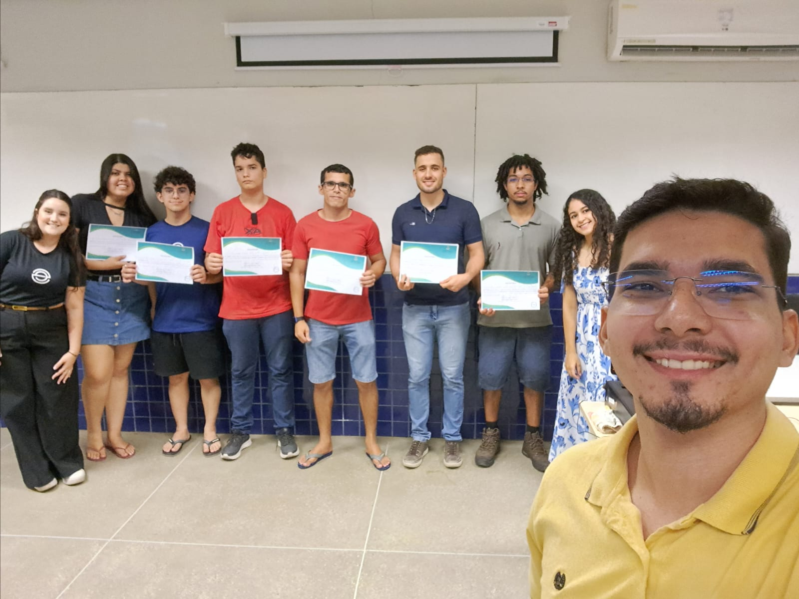
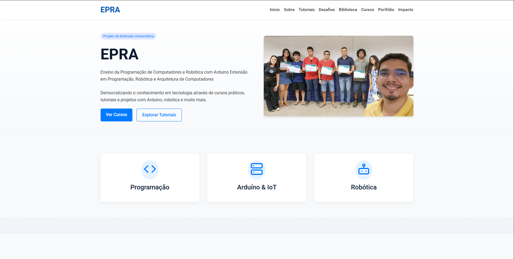
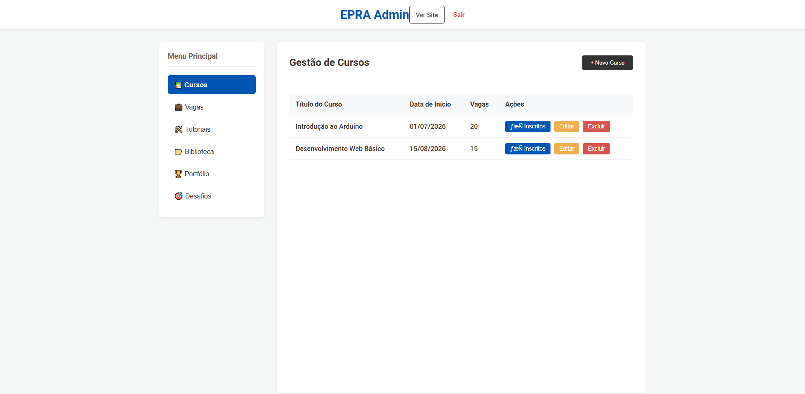
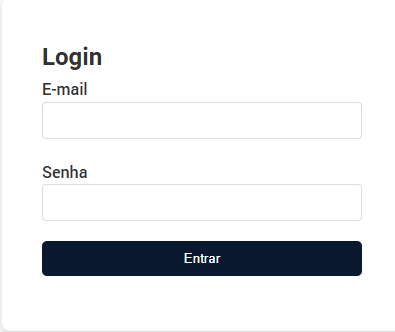
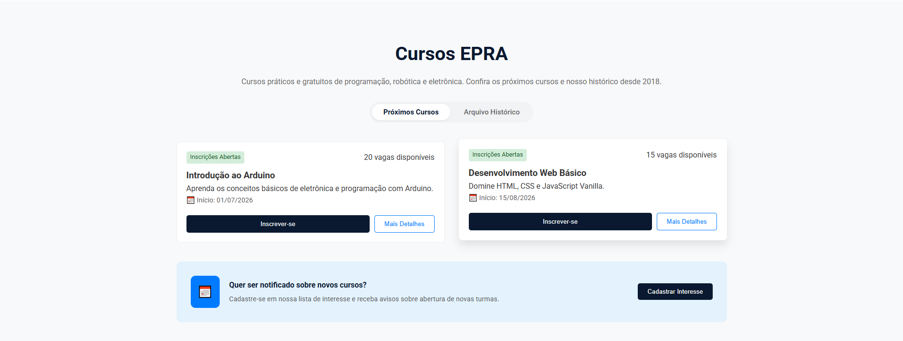

<div align="center">
  

  # 🤖 EPRA - Programação e Robótica
  
  **Ensino da Programação de Computadores e Robótica com Arduino** <br>
  *Extensão em Programação, Robótica e Arquitetura de Computadores*

  <p align="center">
    <a href="#-sobre-o-projeto">Sobre</a> •
    <a href="#-tecnologias">Tecnologias</a> •
    <a href="#-funcionalidades">Funcionalidades</a> •
    <a href="#-arquitetura">Arquitetura</a> •
    <a href="#-como-executar">Como Executar</a> •
    <a href="#-api">API</a>
  </p>

  
  
  
  
  
</div>

---

## 📖 Sobre o Projeto

O **EPRA** é uma plataforma web desenvolvida para um projeto de Extensão Universitária. Seu principal objetivo é democratizar o conhecimento em tecnologia, oferecendo cursos práticos, tutoriais, desafios e projetos voltados para **Arduino, Robótica e Arquitetura de Computadores**.

A plataforma conecta orientadores, alunos internos (bolsistas/voluntários) e alunos externos (comunidade), permitindo o gerenciamento de inscrições em cursos, candidaturas a vagas no projeto, envio de soluções para desafios de código/robótica, e muito mais.

### 🎯 Público-Alvo
- **Estudantes universitários** buscando projetos de extensão em tecnologia.
- **Comunidade em geral** interessada em aprender programação e robótica do zero.
- **Professores e Orientadores** que precisam gerenciar turmas, tutoriais e métricas de impacto.

---

## 📸 Demonstração das Telas


<details>
<summary><b>1. Página Inicial (Landing Page)</b></summary>
<br>


</details>

<details>
<summary><b>2. Painel Administrativo (Dashboard)</b></summary>
<br>


</details>

<details>
<summary><b>3. Tela de Login / Cadastro</b></summary>
<br>


</details>

<details>
<summary><b>4. Cursos e Tutoriais</b></summary>
<br>


</details>

---

## 🛠 Tecnologias Utilizadas

O projeto foi construído utilizando as seguintes tecnologias e ferramentas:

### Frontend
| Tecnologia | Descrição |
|---|---|
|  | Estruturação semântica. |
|  | Estilização avançada (Vanilla CSS). |
|  | Lógica e interatividade do lado do cliente (Vanilla JS). |
|  | Ícones vetoriais. |

### Backend (Node.js API)
| Tecnologia | Descrição |
|---|---|
|  | Ambiente de execução. |
|  | Framework minimalista para criação da API REST. |
|  | Autenticação e autorização via Tokens. |
|  | Upload de arquivos (currículos, imagens). |
|  | Controle de acesso a recursos da API. |

### Banco de Dados
| Tecnologia | Descrição |
|---|---|
|  | Banco de dados relacional robusto. |
| **`pg`** | Driver do PostgreSQL para Node.js. |

---

## 📂 Estrutura do Projeto

A arquitetura do projeto segue a separação entre o Client (Frontend estático) e o Server (API Gateway em Node.js).

```bash
EPRA-main/
 ├── css/                   # Folhas de estilo (Vanilla CSS)
 ├── js/                    # Scripts do lado do cliente (Lógica de UI e consumo de API)
 ├── images/                # Imagens, SVGs e assets visuais
 │
 ├── gateway-node/          # ⚙️ BACKEND - API Node.js
 │    ├── src/              # Código fonte da API
 │    │    ├── controllers/ # Lógica de negócio das rotas
 │    │    ├── routes/      # Definição dos endpoints REST
 │    │    ├── config/      # Configurações (ex: conexão com banco)
 │    │    └── server.js    # Entry-point da aplicação
 │    ├── package.json      # Dependências do backend
 │    └── .env              # Variáveis de ambiente
 │
 ├── index.html             # Página inicial
 ├── admin.html             # Dashboard administrativo
 ├── login.html             # Página de autenticação
 ├── projeto.html           # Página de detalhes de projetos
 ├── tutorial.html          # Visualizador de tutoriais
 └── database_setup.sql     # Script de inicialização e seeds do banco de dados
```

---

## ✨ Funcionalidades

- [x] **Autenticação:** Sistema de Login e Cadastro (JWT).
- [x] **Níveis de Acesso:** Orientador, Aluno Interno e Aluno Externo.
- [x] **Gestão de Cursos:** Inscrição em cursos e controle de vagas disponíveis.
- [x] **Desafios e Gamificação:** Envio de soluções (link GitHub) para desafios propostos.
- [x] **Oportunidades (Vagas):** Candidatura para vagas de bolsistas/voluntários (upload de currículo).
- [x] **Tutoriais:** Publicação de tutoriais passo-a-passo sobre Arduino, robótica e programação.
- [x] **Portfólio & Depoimentos:** Exibição de projetos da equipe e depoimentos aprovados.
- [x] **Painel Administrativo:** Dashboard exclusivo para orientadores gerenciarem a plataforma (Métricas, inscrições, publicações).

---

## 🚀 Como Executar o Projeto (Localmente)

Siga os passos abaixo para rodar o projeto em sua máquina local.

### 1. Pré-requisitos
- [Node.js](https://nodejs.org/) (versão 18+)
- [PostgreSQL](https://www.postgresql.org/) (instalado e rodando)
- [Git](https://git-scm.com/)

### 2. Clonando o Repositório
```bash
git clone https://github.com/MatheusNLima/EPRA.git
cd EPRA-main
```

### 3. Configurando o Banco de Dados
1. Abra o seu gerenciador do PostgreSQL (pgAdmin, DBeaver ou terminal).
2. Crie um banco de dados chamado `epra_db`.
3. Execute o script `database_setup.sql` localizado na raiz do projeto para criar as tabelas e inserir os dados iniciais.

### 4. Configurando o Backend (API)
Navegue até a pasta do backend:
```bash
cd gateway-node
```

Instale as dependências:
```bash
npm install
```

Crie um arquivo `.env` na pasta `gateway-node` copiando o exemplo:
```bash
cp .env.example .env
```

Configure as variáveis no seu `.env`:
```env
PORT=3000
DB_USER=seu_usuario_postgres
DB_HOST=localhost
DB_NAME=epra_db
DB_PASSWORD=sua_senha_postgres
DB_PORT=5432
JWT_SECRET=uma_chave_super_secreta_e_segura
```

Inicie o servidor de desenvolvimento:
```bash
npm run dev
```
> A API estará rodando em `http://localhost:3000`.

### 5. Executando o Frontend
O frontend foi construído com HTML/CSS/JS puro, então você não precisa de um processo de build complexo. 
Basta utilizar um servidor local estático.

Se você usa o **VS Code**, instale a extensão **Live Server** e clique em "Go Live" no arquivo `index.html`.
Ou use o Node.js para servir estaticamente a partir da raiz:
```bash
npx serve .
```
> Acesse no navegador o link gerado (geralmente `http://localhost:5000`).

---

## 📡 API Endpoints Principais

A API está organizada sob as seguintes rotas base (exemplo de arquitetura REST):

| Rota | Método | Descrição | Autenticação |
|---|---|---|---|
| `/api/auth/login` | `POST` | Autentica um usuário e retorna JWT | Não |
| `/api/usuarios` | `POST` | Cadastra um novo usuário | Não |
| `/api/cursos` | `GET` | Lista os cursos disponíveis | Não |
| `/api/cursos/inscricao` | `POST` | Inscreve aluno em curso | Sim |
| `/api/desafios` | `GET` | Lista desafios ativos | Não |
| `/api/vagas/candidatura`| `POST` | Envia candidatura (FormData/Upload) | Sim |
| `/api/admin/metricas` | `GET` | Retorna KPIs da plataforma | Sim (Orientador) |

---

## 🧪 Testes


Atualmente, os testes devem ser realizados manualmente utilizando ferramentas como **Postman** ou **Insomnia** para a API, importando as rotas da aplicação, e testes exploratórios no Frontend.

---

## 📈 Roadmap (Futuras Melhorias)

- [ ] Migração do Frontend para um framework moderno (React.js ou Vue.js).
- [ ] Implementação de recuperação de senha via e-mail.
- [ ] Integração com CI/CD (GitHub Actions).
- [ ] Dockerização completa do projeto (Frontend + Backend + DB).
- [ ] Suporte a Modo Escuro/Claro nativo.

---

## 🤝 Como Contribuir

Contribuições são super bem-vindas! Se você deseja ajudar o projeto, siga os passos:

1. Faça um **Fork** do projeto
2. Crie uma branch para sua feature (`git checkout -b feature/MinhaFeatureIncrível`)
3. Faça commit de suas alterações (`git commit -m 'feat: Adicionando uma feature incrível'`)
4. Faça push para a branch (`git push origin feature/MinhaFeatureIncrível`)
5. Abra um **Pull Request** detalhando suas alterações.

### 📝 Padrão de Commits
Utilizamos o padrão [Conventional Commits](https://www.conventionalcommits.org/).
- `feat:` Novas funcionalidades.
- `fix:` Correção de bugs.
- `refactor:` Refatoração de código.
- `docs:` Alterações em documentação.

---

## 📄 Licença

Este projeto está sob a licença **MIT**. Veja o arquivo [LICENSE](LICENSE) (caso exista) para mais detalhes.

---

## 👨‍💻 Autor(es)

Projeto desenvolvido com foco na extensão universitária e ensino tecnológico.

- **Matheus Lima** - Desenvolvedor Principal 
  - GitHub: [@MatheusNLima](https://github.com/MatheusNLima)
- **Lucas Maia** - Desenvolvedor
  - GitHub: [@gatsby-anon](https://github.com/gatsby-anon)

---

<p align="center">
  Feito com ❤️ para o ensino de tecnologia e robótica! 🚀
</p>